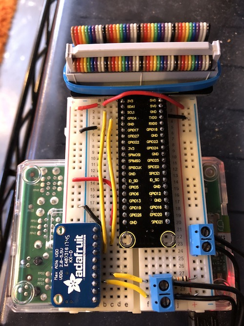
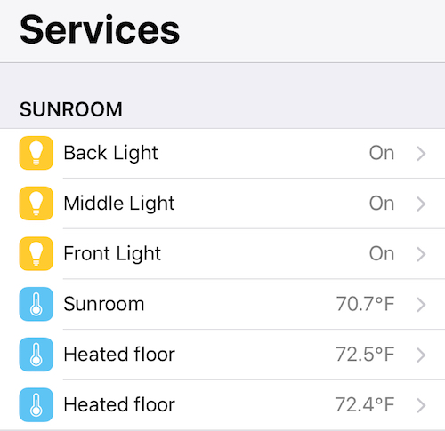

This is the code for a fun home electronics project I did with my son.

Two [thermistors](https://en.wikipedia.org/wiki/Thermistor) are
embedded in a radiant floor heating system.  The thermistors are meant
to be used with the thermostat included in the system, but I decided
to install a Nest thermostat instead, which can't use these.

We took a Raspberry Pi and an [ADS1015 I2C 12-bit analog-to-digital
converter](https://www.adafruit.com/product/1083), connected the two
thermistors to it, do a little math, and report the detected
temperatures as a thermometer device in Apple HomeKit.  The code is in
Go, uses [Gobot](https://gobot.io) for interfacing with the ADS1015
over the I2C bus and uses [HomeControl](https://github.com/brutella/hc)
to announce accessories and services to HomeKit.

This code is specific to our implementation and probably not very
useful, but can be a decent example of how to use Gobot, HomeControl,
the ADS1015 ADC, and calculating temperatures from thermistors in
general.

### Build

Cross-compile for the Raspberry Pi

    $ GOARCH=arm GOOS=linux go build

Then `scp` it to `/usr/local/bin` on the Pi.

A `systemd` unit file (`thermistor.service`) is included.  Copy the
unit file to `/etc/systemd/system` and then run:

    $ sudo systemctl daemon-reload
    $ sudo systemctl enable thermistor
    $ sudo systemctl start thermistor

### License

The code is licensed under the MIT license.  See the
[LICENSE](LICENSE) file for details.
